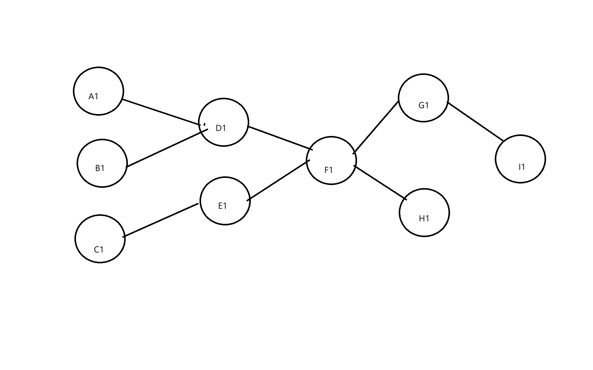
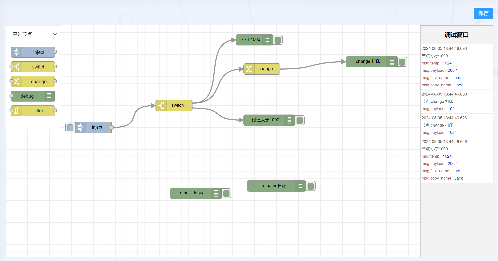

## 基于liteflow实现的规则引擎

### 版本信息

+ graalvm jdk-17
+ springboot 3.2.2
+ liteflow 2.12.1

### 说明
此仓库是一个基础框架，请勿用于生产环境，仅供学习。

### 功能介绍
这是一个通过liteflow作为底层编排及执行引擎的规则引擎工具。
主要实现了如下功能:
1. 基础功能节点inject(数据注入)、change(变换)、filter(过滤)、switch(分支)、debug(调试)、script(脚本执行)和高级功能节点mqttIn(mqtt输入)、mqttOut(mqtt输出)的定义及实现
    + <strong>inject</strong> 可以生成数据放入规则链中，允许单次或周期性发送数据，也可以手动触发
    + <strong>change</strong> 允许在规则链上下文中新增、删除、修改数据项
    + <strong>filter</strong> 校验规则链中每次经过的数据，阻塞不符合条件的数据
    + <strong>switch</strong> 校验规则链中每次经过的数据，允许符合特定条件的数据通过
    + <strong>debug</strong>  规则链的终点节点，将结果输出到mqtt的指定topic中
    + <strong>script</strong> 自定义javascript脚本，可以和上下文中的数据互动
    + <strong>mqttIn</strong> 接受特定topic的消息
    + <strong>mqttOut</strong> 输出数据到指定的topic
2. 将图形化的规则链转换为图，再将图转换为语法树，通过语法树生成[liteflow](https://liteflow.cc/)的DSL语法，最后进行执行。<br />
   例如，有如下图中的规则链:
   
   通过上述功能的转换成的DSL为(默认都是普通节点): <br/>
   <strong><i>THEN(A1, D1, F1, WHEN(G1, H1), I1); </i></strong> <br/>
   <strong><i>THEN(B1, D1, F1, WHEN(G1, H1), I1); </i></strong><br/>
   <strong><i>THEN(C1, E1, F1, WHEN(G1, H1), I1); </i></strong><br/>
3. 节点和连线关系的数据保存，包括节点所在坐标、其子节点及其连线。允许动态的新增和删除节点。
4. 实现了liteflow上下文的数据隔离机制，现在允许将父节点的数据副本分发给他的子节点，具体内容请查看抽象类`IsolationComponent`。

### 节点开发过程
1. 定义节点
需要再module(ruleForge-common-use)中进行节点功能的定义。Node类需要继承自<strong>BasicNode<P, R></strong>，其中P代表输入的属性，如需要指定的数据项，各种配置。
R代表的是规则，例如过滤的条件、具体的脚本语言等。上述P、R两个泛型类需要自己定义，通常定义在Node类中。例如filter的定义:<br />
```java
package com.yunext.common.node.common;

import com.yunext.common.base.BasicNode;
import com.yunext.common.enums.FilterCmdEnum;
import com.yunext.common.utils.ModelMapperUtil;

import java.io.Serializable;
import java.util.Map;
import java.util.Objects;
import java.util.Optional;


public class FilterNode extends BasicNode<FilterNode.FilterProp, FilterNode.FilterRule> implements Serializable {

    public static class FilterProp {
        /**
         * 节点id
         */
        private String nodeId;
        /**
         * 监控的属性名
         */
        private String propName;

        public String getPropName() {
            return propName;
        }

        public void setPropName(String propName) {
            this.propName = propName;
        }

        public Optional<String> getNodeId() {
            return Optional.ofNullable(nodeId);
        }

        public void setNodeId(String nodeId) {
            this.nodeId = nodeId;
        }
    }

    public static class FilterRule {
        /**
         * 筛选指令
         */
        private FilterCmdEnum cmd;
        /**
         * 数据变化范围
         */
        private Double range;

        public FilterCmdEnum getCmd() {
            return cmd;
        }

        public void setCmd(FilterCmdEnum cmd) {
            this.cmd = cmd;
        }

        public Double getRange() {
            return range;
        }

        public void setRange(Double range) {
            this.range = range;
        }
    }
}

```
2. 执行逻辑
在module(ruleForge-work-core)中进行执行逻辑的编写。首先定义节点相应的组件类，需要继承自<strong>IsolationNodeComponent</strong> 或 <strong>IsolationSwitchComponent</strong> ，并且需要使用注解<strong>@LiteflowComponent</strong>。
在组件类中，通过 `this.getCmpData(ComponentContext.class)`获取到组件的节点定义信息，`ComponentContext`类中的props为泛型定义中的输入属性，rules为泛型定义中的规则，根据自己定义的属性和规则类的类型就可以获取到相应的定义信息，如: <br />
```java
FilterNode.FilterProp prop = this.getProp(subContext.getRuleIndex(), FilterNode.FilterProp.class);
FilterNode.FilterRule rule = this.getRule(subContext.getRuleIndex(), FilterNode.FilterRule.class);
```
根据属性和规则，我们就可以在`process` 或 `processSwitch`方法中编写相应的执行逻辑，具体取决于你想要定义什么样的节点。

### 可参考的前端功能实现
以下是一个参照[node-red](https://nodered.org/)实现的前端功能图，仅作为参考。 <br />

